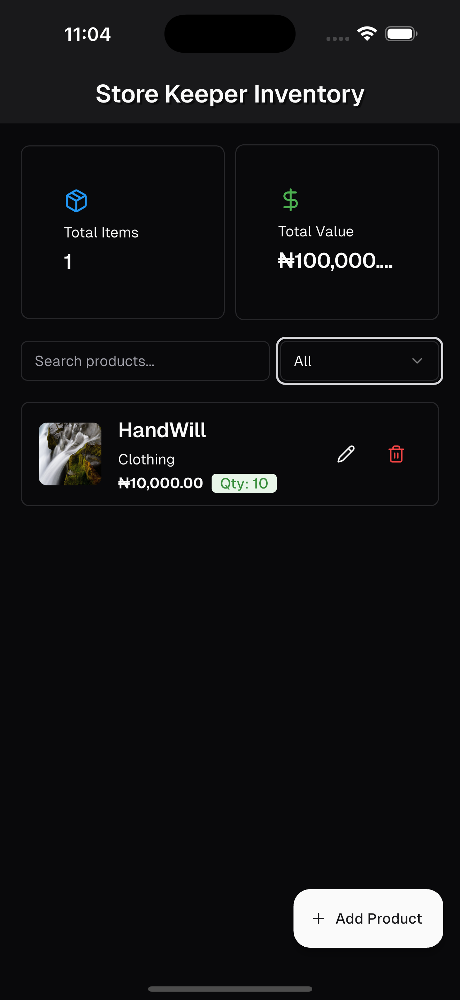
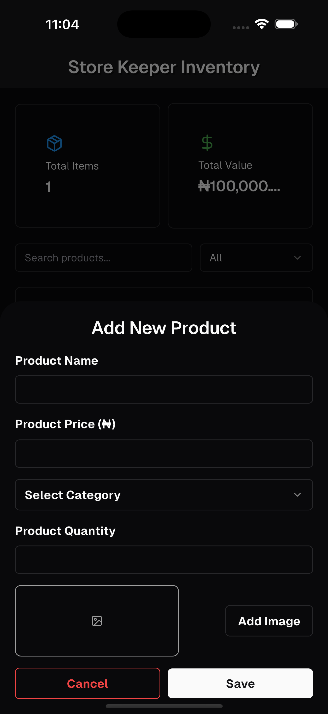
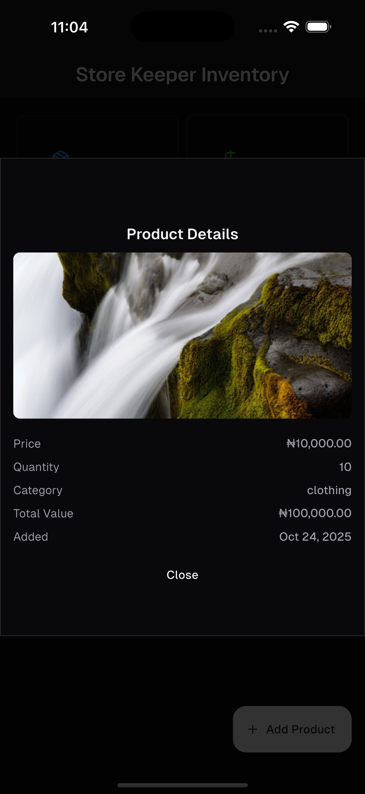

# Store Keeper

A simple inventory management app built with Flutter.

## Description

Store Keeper is a mobile application designed to help small business owners manage their inventory. It allows users to add, edit, and delete products, as well as track the total number of items and their value. The app features a clean and modern user interface built with the `shadcn_ui` package.

## Features

- **Product Management:** Add, edit, and delete products with details such as name, price, quantity, category, and image.
- **Inventory Statistics:** View the total number of products and the total value of the inventory.
- **Search and Filter:** Easily search for products by name and filter them by category.
- **Image Support:** Add images to products from the device's gallery.
- **Local Storage:** Products are stored locally on the device using an SQLite database.
- **User-Friendly Interface:** A clean and intuitive UI for a seamless user experience.

## Screenshots

<div align="center">




</div>


## Demo

[Watch Video Demo](https://github.com/mhkaycey/store_keeper/blob/main/screenshots/vid.mov)
</video>

## Getting Started

To get a local copy up and running, follow these simple steps.

### Prerequisites

- Flutter SDK: [https://flutter.dev/docs/get-started/install](https://flutter.dev/docs/get-started/install)
- Dart SDK: [https://dart.dev/get-dart](https://dart.dev/get-dart)

### Installation

1.  Clone the repo
    ```sh
    git clone https://github.com/mhkaycey/store_keeper.git
    ```
2.  Install packages
    ```sh
    flutter pub get
    ```
3.  Run the app
    ```sh
    flutter run
    ```

## Project Structure

```
lib/
├── model/
│   └── product_model.dart
├── screens/
│   ├── add_product.dart
│   └── components/
├── service/
│   └── product_services.dart
├── utils/
│   └── toast.dart
├── home_page.dart
└── main.dart
```

## Dependencies

- `flutter`
- `cupertino_icons`
- `shadcn_ui`
- `sqflite`
- `path`
- `intl`
- `image_picker`
- `uuid`
- `toastification`

## Dev Dependencies

- `flutter_test`
- `flutter_lints`
